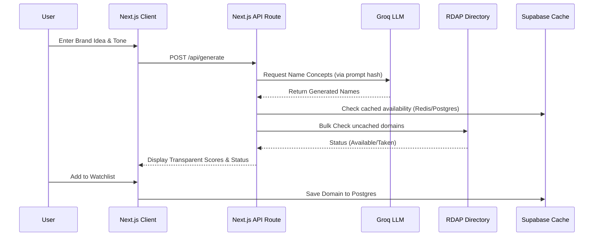

<div align="center">
  
  # 🌌 DomainForge

  **The Intelligent Domain Name Discovery & Availability Platform**

  [](https://nextjs.org/)
  [](https://react.dev/)
  [](https://tailwindcss.com/)
  [](https://supabase.com/)
  [](https://groq.com/)
  [](https://opensource.org/licenses/MIT)

  <p align="center">
    <strong>Stop manually typing names into a registrar to see if they are taken.</strong><br>
    DomainForge combines ultra-fast AI generation with real-time ICANN RDAP lookups, multi-layered caching, and trademark risk analysis to help you secure the perfect brand identity in milliseconds.
  </p>
  
  [Quick Start](#-quick-start) •
  [Key Features](#-core-features) •
  [Engineering](#️-engineering--performance) •
  [Architecture](#-architecture)

</div>

---

## 💡 Why DomainForge?

Finding a domain name today is fundamentally broken. You come up with a great idea, check a registrar, find it's taken, and repeat this cycle until you settle for a mediocre name. 

**DomainForge flips this workflow:**
You describe your business, audience, and preferred tone (e.g., *Playful, Professional, Minimal*). DomainForge generates dozens of highly-targeted, brandable names and **instantly checks their availability** across your preferred TLDs (.com, .io, .ai, .dev), alongside social handle availability. It's the ultimate naming co-pilot.

---

## ✨ Core Features

### 🧠 Multi-dimensional AI Naming
Powered by the Groq LLM inference engine, DomainForge doesn't just append random prefixes. It understands semantic context. Use our intuitive Tone Presets to guide the AI, or dive into Advanced Sliders (Modern, Cool, Short) for absolute granular control.

### ⚡ Real-Time Availability (Tiered Accuracy)
We use direct ICANN-standard RDAP queries. No fragile registrar scraping.
- **Tier 1 (.com, .io, .ai, .co, .dev):** 95%+ accuracy with real-time green/red status.
- **Parked Domain Detection:** If a domain is taken but parked for resale, we'll try to surface estimated aftermarket pricing so you aren't met with a dead end.

### 🛡️ Social Handle & Trademark Risk
Your domain is only half the battle. DomainForge automatically checks exact-match availability for your name on major social platforms (X, Instagram). It also runs a baseline risk check against USPTO trademark data to keep you legally safe.

### 📊 Transparent, Decomposed Scoring
We hate opaque "Brand Scores". Every suggestion is graded on transparent metrics:
- **Brandability** (Avoids hyphens/numbers)
- **Typeability** (Brevity & pronunciation)
- **Keyword Relevance** (Match to your prompt)
- **TLD Trust** (.com > .io > .co)

### 🔔 Watchlist & Automated Alerts
Found a domain you love but isn't available? Add it to your Watchlist. DomainForge uses cron jobs and Resend to monitor the domain and alert you via email the moment it drops.

### 💬 Context-Aware AI Assistant
Built directly into the dashboard, our embedded AI Assistant acts as your personal domain consultant. Powered by Groq, the chatbot is fully aware of your profile, securely reading your **Watchlist, Shortlists, and personal notes** in real-time. Ask it to evaluate your saved domains, brainstorm SEO-friendly alternatives, or assess brand strength based on the exact domains you're already monitoring.

---

## ⚙️ Engineering & Performance

DomainForge isn't just a UI wrapper; it's a highly optimized, production-ready application built for scale and reliability.

- **Aggressive Multi-Tier Caching:** Implements Redis alongside a Supabase `domain_cache` layer (with intelligent 5-minute TTLs) to drastically reduce expensive RDAP calls and prevent redundant LLM regeneration.
- **Edge-Optimized Architecture:** Built on Next.js 16 with Edge API routes to ensure globally distributed, low-latency execution (<3s response times).
- **Abuse Protection & Rate Limiting:** Built-in IP/fingerprint rate limiting secures the LLM endpoints from runaway costs and prevents registrars from blocking our RDAP requests.
- **Graceful Degradation:** A resilient architecture that falls back gracefully if an RDAP registry times out or a third-party API fails. You will always see partial results or "unverified" flags, never a broken UI.
- **Enterprise-Grade Security:** Utilizes Supabase Row Level Security (RLS) to ensure absolute data isolation for user watchlists and secure authentication flows.

---

## 🎯 Who is this for?

- **Indie Hackers & Founders:** Stop wasting days naming your startup. Get a name, buy the domain, and start building.
- **"Vibe Coders":** If you use tools like Lovable, Bolt, or Replit to build MVPs in hours, you need a naming tool that moves just as fast.
- **Marketing Agencies:** Generate highly relevant, available domain lists for your clients in a fraction of the time.

---

## 🚀 Quick Start

Get your local environment running in under 3 minutes.

### 1. Clone the repository

```bash
git clone https://github.com/your-username/DomainForge.git
cd DomainForge
```

### 2. Install dependencies

```bash
npm install
```

### 3. Configure Environment Variables

```bash
cp .env.example .env.local
```

| Variable | Usage | Visibility |
|---|---|---|
| `NEXT_PUBLIC_SUPABASE_URL` | Supabase API endpoint | ✅ Client (Safe — RLS) |
| `NEXT_PUBLIC_SUPABASE_ANON_KEY` | Supabase public key | ✅ Client (Safe — RLS) |
| `SUPABASE_SERVICE_ROLE_KEY` | Server-only admin ops | ❌ Server Only |
| `GROQ_API_KEY` | LLM generation | ❌ Server Only |
| `RESEND_API_KEY` | Email monitoring alerts | ❌ Server Only |
| `CRON_SECRET` | Cron job auth header | ❌ Server Only |
| `MARKERAPI_USERNAME` / `PASSWORD` | USPTO trademark check | ❌ Server Only |

### 4. Start the development server

```bash
npm run dev
```

Visit [http://localhost:3000](http://localhost:3000) to start generating!

---

## 🏗️ Architecture Flow



---

## 🤝 Contributing

We welcome contributions! Whether it's adding a new TLD parser, improving the AI prompts, or polishing the UI:

1. Fork the repository
2. Create a feature branch (`git checkout -b feature/amazing-feature`)
3. Commit your changes (`git commit -m 'feat: add amazing feature'`)
4. Push to the branch (`git push origin feature/amazing-feature`)
5. Open a Pull Request

---

## 📜 Trust & Privacy

**We never register, warehouse, or share the names you search for.** Your ideas are yours alone. All availability checks are performed directly against ICANN registry endpoints, bypassing registrar intermediaries entirely.

*Disclaimer: Availability checks are not a substitute for a comprehensive trademark or legal clearance check. Always consult a professional before finalizing a commercial brand name.*

<div align="center">
  <br/>
  <sub>Made with ❤️ by Harsh Mehta.</sub>
</div>
