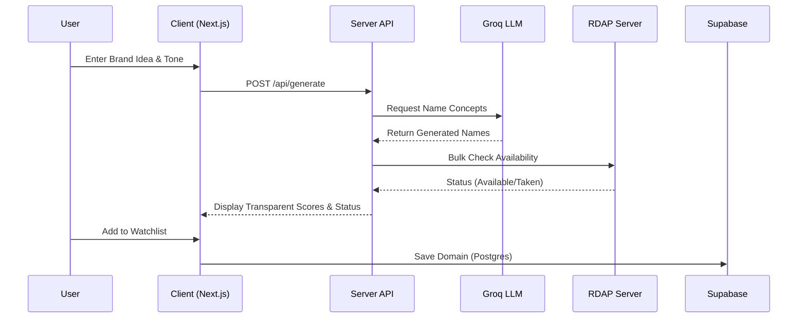

<div align="center">
  
  # 🌌 DomainForge

  **The Intelligent Domain Name Discovery & Availability Platform**

  [](https://nextjs.org/)
  [](https://react.dev/)
  [](https://tailwindcss.com/)
  [](https://supabase.com/)
  [](https://opensource.org/licenses/MIT)

  <p align="center">
    DomainForge helps you find the perfect domain name using AI-powered suggestions tailored to your brand's unique tone, seamlessly verifying availability and trademark risk in real-time.
  </p>
  
  [Quick Start](#-quick-start) •
  [Key Features](#-key-features) •
  [Architecture](#-architecture) •
  [Documentation](#-documentation)

</div>

---

## ✨ Key Features

DomainForge is built for indie hackers, founders, and creators who need brandable, available domain names without the manual guesswork.

* 🧠 **Multi-dimensional AI Generation:** Powered by Groq, generate names based on business description, category, and precise tone presets (Playful, Corporate, Minimal, Bold).
* ⚡ **Real-time Availability Checking:** ICANN-standard RDAP queries for 95%+ accuracy on Tier 1 TLDs (.com, .io, .ai, .dev), avoiding fragile registrar scraping.
* 🛡️ **Trademark Risk & Social Handles:** First-class social handle checking and baseline trademark risk scoring via USPTO data.
* 📊 **Transparent Domain Scoring:** Decomposed scores grading Brandability, Typeability, Keyword relevance, and TLD trust. No opaque black-box numbers.
* 🔔 **Watchlist & Alerts:** Save domains to a shortlist and monitor their availability over time via automated email alerts (powered by Resend).
* 🎨 **Stunning UI/UX:** Built with a modern 2026 aesthetic using Tailwind CSS v4, Framer Motion, Shadcn UI, and React 19.

---

## 🚀 Quick Start

Get up and running locally in under 3 minutes.

### 1. Clone the repository

```bash
git clone https://github.com/your-username/DomainForge.git
cd DomainForge
```

### 2. Install dependencies

```bash
npm install
```

### 3. Configure Environment Variables

Copy the example environment file and fill in your keys:

```bash
cp .env.example .env.local
```

### 4. Start the development server

```bash
npm run dev
```

Your app will be running at [http://localhost:3000](http://localhost:3000).

---

## 🛠️ Configuration & Environment

| Variable | Usage | Visibility |
|---|---|---|
| `NEXT_PUBLIC_SUPABASE_URL` | Supabase API endpoint | ✅ Client (Safe — RLS) |
| `NEXT_PUBLIC_SUPABASE_ANON_KEY` | Supabase public key | ✅ Client (Safe — RLS) |
| `SUPABASE_SERVICE_ROLE_KEY` | Server-only admin ops | ❌ Server Only |
| `GROQ_API_KEY` | LLM generation | ❌ Server Only |
| `RESEND_API_KEY` | Email monitoring alerts | ❌ Server Only |
| `CRON_SECRET` | Cron job auth header | ❌ Server Only |
| `MARKERAPI_USERNAME` / `PASSWORD` | USPTO trademark check | ❌ Server Only |
| `NEXT_PUBLIC_SENTRY_DSN` | Error reporting ingest | ✅ Client (Safe) |
| `SENTRY_AUTH_TOKEN` | Source map upload | ❌ Build Only |

> [!NOTE]
> **Supabase RLS**: The Anon Key is exposed to the browser intentionally. Ensure Row Level Security (RLS) is enabled on every Supabase table.

---

## 🏗️ Architecture Flow



---

## 🤝 Contributing

We welcome contributions from the community! 

1. Fork the repository
2. Create your feature branch (`git checkout -b feature/amazing-feature`)
3. Commit your changes (`git commit -m 'feat: add amazing feature'`)
4. Push to the branch (`git push origin feature/amazing-feature`)
5. Open a Pull Request

Please ensure your code passes `npm run lint` and `npm run typecheck` before submitting.

---

## 📜 Privacy & Trust

**DomainForge never registers, resells, or shares the names you search for.** Your ideas remain yours. 
Availability checks are done directly against registry RDAP endpoints, bypassing registrar intermediaries.

*Disclaimer: Availability is not a trademark or legal clearance check. Always consult a professional before finalizing a brand name.*

---

## 🏆 Acknowledgments

- [Groq](https://groq.com/) for lightning-fast LLM inference.
- [Supabase](https://supabase.com/) for seamless open-source database & auth.
- [Vercel](https://vercel.com) for edge hosting.
- [Resend](https://resend.com) for transactional emails.

<div align="center">
  <br/>
  <sub>Made with ❤️ by Harsh Mehta.</sub>
</div>
